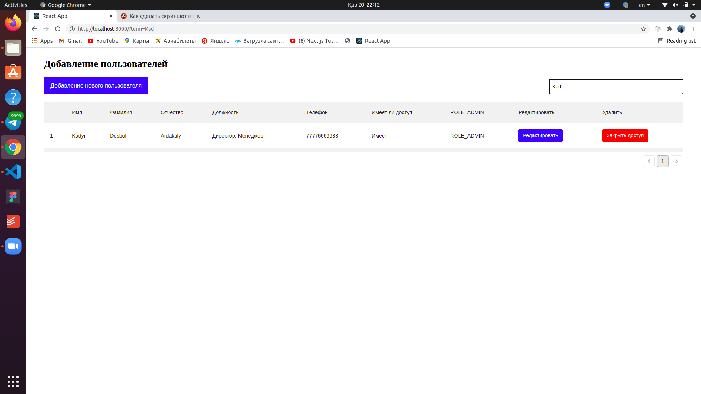
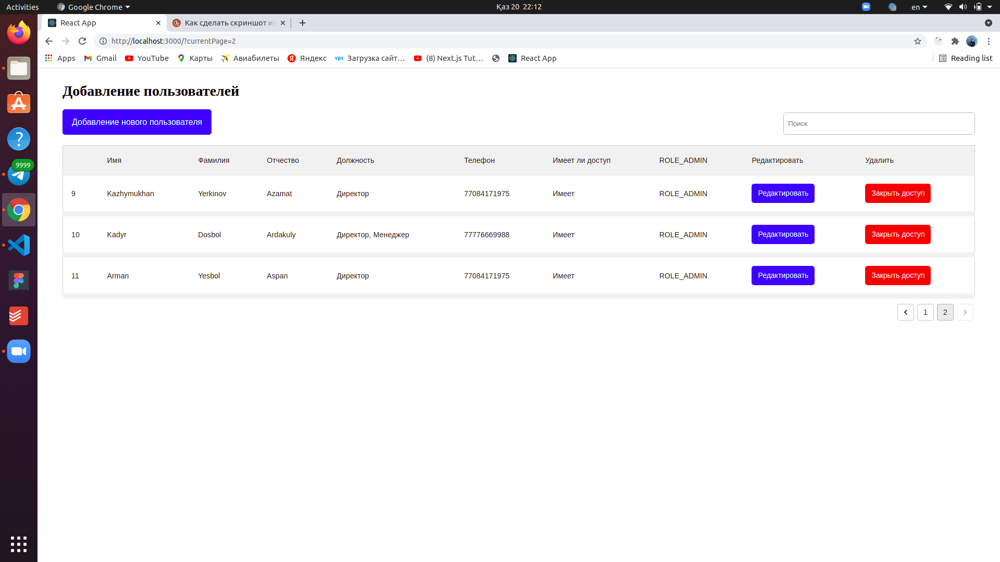
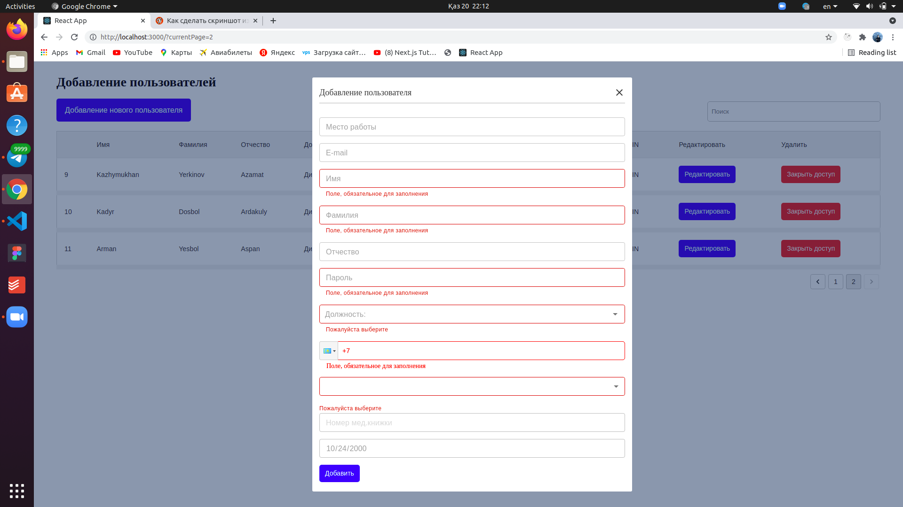
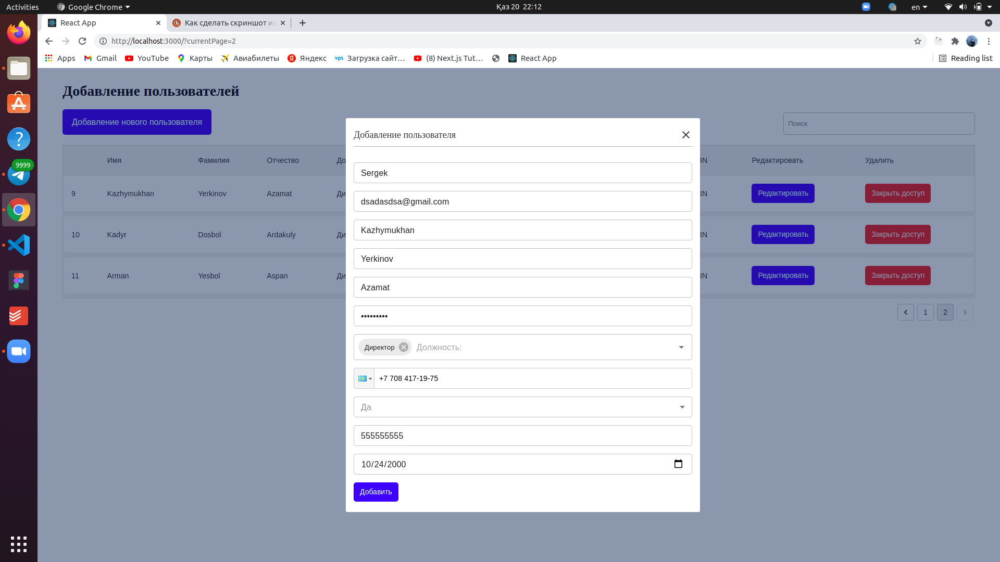

# CRUD (Test APP)

## Доступные скрипты

В каталоге проекта вы можете запустить:

### `npm run server`

Команда для запуска json-server. Сначала запишите эту команду. Это запустит локальный фальшивый сервер

### `npm start`

Запустить приложение в режиме разработки.\
Откройте [http: // localhost: 3000] (http: // localhost: 3000), чтобы просмотреть его в браузере.

## Функционалы

### `Debounce Search`
Если вы наберете что-нибудь в поисковике. Он отправляет запрос на сервер через 1 секунду без каких-либо кнопок

### `Pagination`
Каждый раз, когда вы меняете страницу, currentPage добавляется к URL-адресу. Потому что, когда вы отправляете его другим людям, открывается та же самая страница.

### `Validations`
Место работы - не обязательное поле.\
E-mail - не обязательное поле. Есть проверки электронной почты (@.).\
Имя - обязательное поле.\
Фамилия - обязательное поле.\
Отчество - не обязательное поле.\
Пароль - обязательное поле. Не менее 4 символов (буквы и цифры)
Должность - обязательное поле. Множественный выбор. \
Телефон - обязательное поле. Формат +7 777-77-77 \
Мед.Книжка - Переключатель. Если "да", Номер мед.книжки и Дата выдачи медицинский книжки будут включены. Если "нет", тогда будут отключены \
Номер мед.книжки - обязательное поле. Только цифры \
Дата выдачи медицинский книжки - обязательное поле

### `Edit User`
Открывается при нажатии кнопки «Изменить».

### `Delete User`

Нажмите кнопку «Закрыть доступ», чтобы удалить

## Видео со всеми функциями https://www.youtube.com/watch?v=dnDDVA9CmRA

